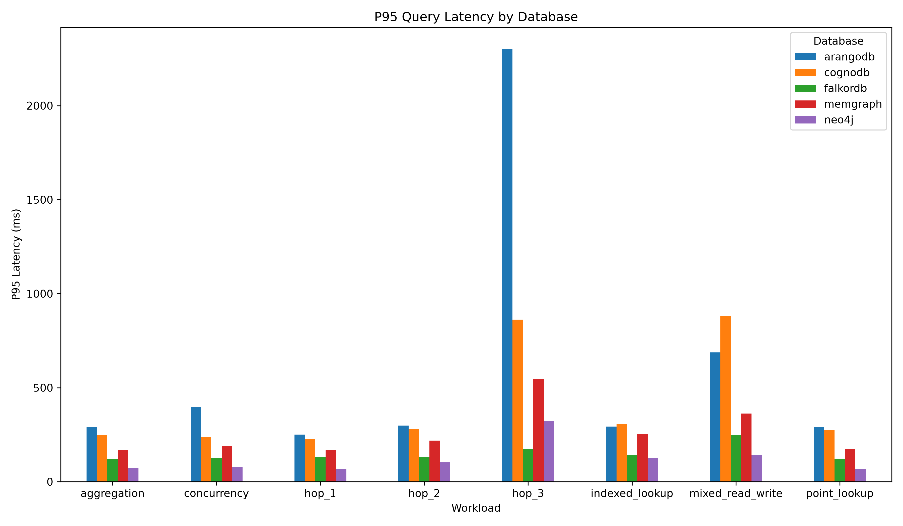

# CognoDB Cloud Benchmark

A reproducible benchmark comparing CognoDB Cloud with other managed graph
database platforms using a common public graph dataset and equivalent
logical workloads.

## Benchmark Platforms

1. CognoDB Cloud
2. Neo4j AuraDB
3. Memgraph Cloud
4. ArangoDB ArangoGraph
5. FalkorDB Cloud

## Dataset

SNAP wiki-Vote

- Nodes: 7,115
- Relationships: 103,689
- Graph type: Directed
- Domain: Wikipedia administrator elections

The original dataset contains directed edges representing votes between
Wikipedia users.

## Benchmark Dataset Preparation

The original relationships are preserved.

A deterministic `user_type` property is added to nodes for the
indexed/filtered lookup workload:

`user_type = user_id % 10`

This property is synthetic and is clearly distinguished from the original
dataset attributes.

## Fairness

Each platform will use its lowest practical free or trial managed tier.
Because the platforms expose different resource limits, CPU, memory,
storage, and trial limitations will be documented and reported rather than
treated as identical.

## Planned Workloads

- Data ingestion
- 1-hop traversal
- 2-hop traversal
- 3-hop traversal
- Point lookup
- Indexed/filtered lookup
- Aggregation
- Mixed read/write workload
- Concurrency testing

## Benchmark Results

The benchmark evaluates five graph databases using the same dataset, workload definitions, and execution configuration.

### Benchmark Configuration

| Parameter | Value |
|---|---:|
| Databases | 5 |
| User nodes | 7,115 |
| `VOTED_FOR` relationships | 103,689 |
| Measured iterations | 100 |
| Warmup iterations | 30 |
| Starting user ID | 30 |
| Workloads | 8 |
| Failed iterations | 0 |

### Workloads

The following workloads were executed against each database:

1. **Point Lookup** — retrieves a single user by `user_id`.
2. **1-Hop Traversal** — retrieves users directly connected to the starting user.
3. **2-Hop Traversal** — retrieves users reachable through exactly two relationships.
4. **3-Hop Traversal** — retrieves users reachable through exactly three relationships.
5. **Indexed Lookup** — retrieves users matching a specific `user_type` value using the configured index.
6. **Aggregation** — counts users grouped by `user_type`.
7. **Mixed Read/Write** — creates or updates, reads, and removes a temporary user.
8. **Concurrency** — executes simultaneous point lookups against the same database.

### Average Latency Results

Lower latency indicates better performance.

| Workload | CognoDB (ms) | Neo4j (ms) | Memgraph (ms) | ArangoDB (ms) | FalkorDB (ms) | Fastest |
|---|---:|---:|---:|---:|---:|---|
| Point Lookup | 228.97 | **61.10** | 163.42 | 237.56 | 114.64 | **Neo4j** |
| 1-Hop Traversal | 218.48 | **61.94** | 162.79 | 212.79 | 116.58 | **Neo4j** |
| 2-Hop Traversal | 262.51 | **95.36** | 206.33 | 228.98 | 120.67 | **Neo4j** |
| 3-Hop Traversal | 765.53 | 268.02 | 493.28 | 2059.88 | **154.99** | **FalkorDB** |
| Indexed Lookup | 287.49 | **112.56** | 235.35 | 226.56 | 130.79 | **Neo4j** |
| Aggregation | 229.13 | **64.84** | 163.02 | 220.99 | 114.76 | **Neo4j** |
| Mixed Read/Write | 798.66 | **133.39** | 332.70 | 631.14 | 230.65 | **Neo4j** |
| Concurrency | 228.71 | **71.49** | 173.68 | 269.81 | 120.81 | **Neo4j** |

### Performance Advantage

The following shows how much faster the best-performing database was compared with the second-fastest database for each workload.

| Workload | Fastest | Second Fastest | Advantage |
|---|---|---|---:|
| Point Lookup | Neo4j | FalkorDB | **46.7%** |
| 1-Hop Traversal | Neo4j | FalkorDB | **46.9%** |
| 2-Hop Traversal | Neo4j | FalkorDB | **21.0%** |
| 3-Hop Traversal | FalkorDB | Neo4j | **42.2%** |
| Indexed Lookup | Neo4j | FalkorDB | **13.9%** |
| Aggregation | Neo4j | FalkorDB | **43.5%** |
| Mixed Read/Write | Neo4j | FalkorDB | **42.2%** |
| Concurrency | Neo4j | FalkorDB | **40.8%** |

Percentage advantage is calculated as:

```text
((second-fastest latency - fastest latency) / second-fastest latency) × 100
```

### Relative Performance by Workload

The following tables compare each database with the fastest database for that workload. The percentage is calculated as:

```text
((database latency - best latency) / database latency) × 100
```

#### Point Lookup

| Database | Average latency | Relative performance |
|---|---:|---:|
| **Neo4j** | **61.10 ms** | **Best** |
| FalkorDB | 114.64 ms | 46.70% slower |
| Memgraph | 163.42 ms | 62.61% slower |
| CognoDB | 228.97 ms | 73.32% slower |
| ArangoDB | 237.56 ms | 74.28% slower |

#### 1-Hop Traversal

| Database | Average latency | Relative performance |
|---|---:|---:|
| **Neo4j** | **61.94 ms** | **Best** |
| FalkorDB | 116.58 ms | 46.87% slower |
| Memgraph | 162.79 ms | 61.95% slower |
| ArangoDB | 212.79 ms | 70.89% slower |
| CognoDB | 218.48 ms | 71.65% slower |

#### 2-Hop Traversal

| Database | Average latency | Relative performance |
|---|---:|---:|
| **Neo4j** | **95.36 ms** | **Best** |
| FalkorDB | 120.67 ms | 20.97% slower |
| Memgraph | 206.33 ms | 53.78% slower |
| ArangoDB | 228.98 ms | 58.35% slower |
| CognoDB | 262.51 ms | 63.67% slower |

#### 3-Hop Traversal

| Database | Average latency | Relative performance |
|---|---:|---:|
| **FalkorDB** | **154.99 ms** | **Best** |
| Neo4j | 268.02 ms | 42.17% slower |
| Memgraph | 493.28 ms | 68.58% slower |
| CognoDB | 765.53 ms | 79.75% slower |
| ArangoDB | 2,059.88 ms | 92.48% slower |

#### Indexed Lookup

| Database | Average latency | Relative performance |
|---|---:|---:|
| **Neo4j** | **112.56 ms** | **Best** |
| FalkorDB | 130.79 ms | 13.94% slower |
| ArangoDB | 226.56 ms | 50.32% slower |
| Memgraph | 235.35 ms | 52.17% slower |
| CognoDB | 287.49 ms | 60.85% slower |

#### Aggregation

| Database | Average latency | Relative performance |
|---|---:|---:|
| **Neo4j** | **64.84 ms** | **Best** |
| FalkorDB | 114.76 ms | 43.50% slower |
| Memgraph | 163.02 ms | 60.22% slower |
| ArangoDB | 220.99 ms | 70.66% slower |
| CognoDB | 229.13 ms | 71.70% slower |

#### Mixed Read/Write

| Database | Average latency | Relative performance |
|---|---:|---:|
| **Neo4j** | **133.39 ms** | **Best** |
| FalkorDB | 230.65 ms | 42.17% slower |
| Memgraph | 332.70 ms | 59.91% slower |
| ArangoDB | 631.14 ms | 78.87% slower |
| CognoDB | 798.66 ms | 83.30% slower |

#### Concurrency

| Database | Average latency | Relative performance |
|---|---:|---:|
| **Neo4j** | **71.49 ms** | **Best** |
| FalkorDB | 120.81 ms | 40.82% slower |
| Memgraph | 173.68 ms | 58.84% slower |
| CognoDB | 228.71 ms | 68.74% slower |
| ArangoDB | 269.81 ms | 73.50% slower |

### P95 Latency

P95 represents the latency at which approximately 95% of measured operations completed faster.

| Workload | CognoDB (ms) | Neo4j (ms) | Memgraph (ms) | ArangoDB (ms) | FalkorDB (ms) |
|---|---:|---:|---:|---:|---:|
| Point Lookup | 272.72 | 66.92 | 171.93 | 290.51 | 122.42 |
| 1-Hop Traversal | 224.77 | 67.68 | 168.53 | 250.67 | 131.72 |
| 2-Hop Traversal | 281.34 | 103.20 | 218.14 | 298.58 | 130.93 |
| 3-Hop Traversal | 862.06 | 321.05 | 544.86 | 2,301.51 | 175.29 |
| Indexed Lookup | 307.68 | 124.18 | 254.63 | 292.60 | 143.15 |
| Aggregation | 249.25 | 71.52 | 169.08 | 289.23 | 120.31 |
| Mixed Read/Write | 879.73 | 139.57 | 363.12 | 687.43 | 247.50 |
| Concurrency | 237.43 | 79.35 | 189.14 | 398.35 | 124.95 |

### Overall Ranking

Based on average latency across the eight workloads:

1. **Neo4j** — fastest in 7 of 8 workloads.
2. **FalkorDB** — fastest for 3-hop traversal and second-fastest in the other seven workloads.
3. **Memgraph** — generally middle-performing and substantially faster than CognoDB and ArangoDB for 3-hop traversal.
4. **ArangoDB** — reasonable for shallow queries but extremely slow for 3-hop traversal.
5. **CognoDB** — similar to ArangoDB on shallow workloads but slower than ArangoDB for 3-hop traversal.

### Results Analysis

All five databases completed 100 of 100 measured iterations for every workload, with zero failed operations. The comparison therefore reflects latency differences rather than different success rates.

#### Average Latency

Neo4j achieved the lowest average latency in seven of the eight workloads: point lookup, 1-hop traversal, 2-hop traversal, indexed lookup, aggregation, mixed read/write, and concurrency. Neo4j was therefore the strongest general-purpose performer in this benchmark.

FalkorDB was the fastest database for 3-hop traversal at 154.99 ms and ranked second in the other seven workloads. Its performance remained comparatively consistent as traversal depth increased, which made it the strongest option for the deeper traversal tested.

#### Tail Latency

The P95 results reinforce the average-latency findings. Neo4j had the lowest P95 latency for point lookup, 1-hop traversal, 2-hop traversal, indexed lookup, aggregation, mixed read/write, and concurrency. FalkorDB had the lowest 3-hop P95 latency at 175.29 ms, compared with 321.05 ms for Neo4j.

The largest separation occurred at three hops. FalkorDB's 154.99 ms average was approximately 13.29 times faster than ArangoDB's 2,059.88 ms average. ArangoDB's P95 latency also rose to 2,301.51 ms, indicating that the deeper traversal affected both typical and slower operations.

#### CognoDB and Other Results

CognoDB recorded average latencies of 228.97 ms, 218.48 ms, 262.51 ms, 765.53 ms, 287.49 ms, 229.13 ms, 798.66 ms, and 228.71 ms across the eight workloads. It was faster than ArangoDB for 3-hop traversal, but ArangoDB was faster for the other listed workloads. Memgraph generally occupied the middle of the rankings and outperformed both CognoDB and ArangoDB for 3-hop traversal.

These results show that there is no single winner for every graph workload. Neo4j provided the best overall latency across most tests, while FalkorDB showed a clear advantage for deeper traversal. The findings apply to this dataset, query implementation, managed service configuration, and network environment; they should not be treated as universal rankings for all graph workloads.

### Key Finding: 3-Hop Traversal

The 3-hop traversal produced the clearest performance difference:

| Database | Average latency |
|---|---:|
| **FalkorDB** | **154.99 ms** |
| Neo4j | 268.02 ms |
| Memgraph | 493.28 ms |
| CognoDB | 765.53 ms |
| ArangoDB | 2,059.88 ms |

FalkorDB was approximately **13.29× faster than ArangoDB** for this workload.

### Benchmark Conclusion

Based on the measured workloads, Neo4j provided the best overall performance, achieving the lowest latency in seven out of eight tests. FalkorDB was the best-performing database for 3-hop traversal, demonstrating that workload characteristics can significantly influence graph database performance.

These results should be interpreted within the specific benchmark environment, dataset, query implementations, and network conditions used in this project.
## Final Assignment Checklist

### Database Setup

| Requirement | Status |
|---|---|
| CognoDB, Memgraph, ArangoDB, FalkorDB, and Neo4j connected | Complete |
| Same dataset loaded into all five databases | Complete |
| 7,115 nodes verified | Complete |
| 103,689 `VOTED_FOR` relationships verified | Complete |

### Database Verification

| Requirement | Status |
|---|---|
| Node and relationship counts verified | Complete |
| Point lookup verified | Complete |
| 1-hop traversal verified | Complete |
| User-type lookup verified | Complete |
| Connection tests completed | Complete |

### Benchmarking

| Database | Point Lookup | 1-Hop | 2-Hop | 3-Hop | Indexed Lookup | Aggregation | Mixed Read/Write | Concurrency |
|---|---:|---:|---:|---:|---:|---:|---:|---:|
| CognoDB | Complete | Complete | Complete | Complete | Complete | Complete | Complete | Complete |
| Memgraph | Complete | Complete | Complete | Complete | Complete | Complete | Complete | Complete |
| ArangoDB | Complete | Complete | Complete | Complete | Complete | Complete | Complete | Complete |
| FalkorDB | Complete | Complete | Complete | Complete | Complete | Complete | Complete | Complete |
| Neo4j | Complete | Complete | Complete | Complete | Complete | Complete | Complete | Complete |

All five databases have 100 successful iterations for every executed workload, with zero failed iterations. The benchmark uses 100 measured iterations, 30 warmup iterations, the same dataset, and the same workload definitions.

Aggregation, mixed read/write, and concurrency are included in the current benchmark configuration and have results for all five databases in `results/all_results.json`.

### Results Processing

Complete outputs are generated by `scripts/compare_benchmarks.py`:

- Average, median, minimum, maximum, P50, and P95 latency data are retained in the source JSON.
- Average-latency rankings and fastest databases are written to `results/comparison/average_latency.csv`.
- P95 comparisons are written to `results/comparison/p95_latency.csv`.
- Relative performance percentages are written to `results/comparison/relative_performance.csv`.
- A Markdown comparison report is written to `results/comparison/comparison_report.md`.
- The average-latency chart is stored in `results/charts/benchmark_average_latency.png`.
- The P95-latency chart is stored in `results/charts/benchmark_p95_latency.png`.

The README currently documents the introduction, dataset, database systems, experimental setup, benchmark methodology, workloads, results, performance comparison, analysis, and conclusion. Both average-latency and P95 charts are available under `results/charts/`.


### Benchmark Visualization



