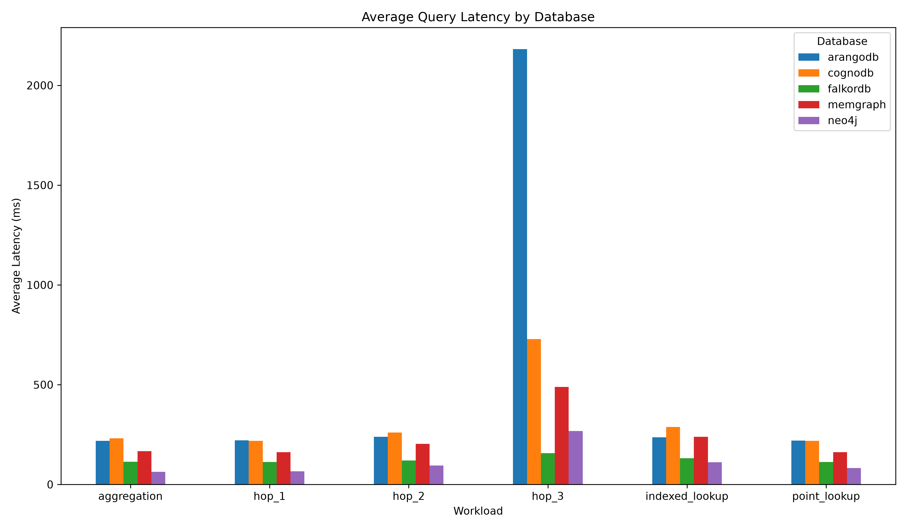

# CognoDB Cloud Benchmark

A reproducible benchmark comparing CognoDB Cloud with other managed graph
database platforms using a common public graph dataset and equivalent
logical workloads.

## Benchmark Platforms

1. CognoDB Cloud
2. Neo4j AuraDB
3. Memgraph Cloud
4. ArangoDB ArangoGraph
5. FalkorDB Cloud

## Dataset

SNAP wiki-Vote

- Nodes: 7,115
- Relationships: 103,689
- Graph type: Directed
- Domain: Wikipedia administrator elections

The original dataset contains directed edges representing votes between
Wikipedia users.

## Benchmark Dataset Preparation

The original relationships are preserved.

A deterministic `user_type` property is added to nodes for the
indexed/filtered lookup workload:

`user_type = user_id % 10`

This property is synthetic and is clearly distinguished from the original
dataset attributes.

## Fairness

Each platform will use its lowest practical free or trial managed tier.
Because the platforms expose different resource limits, CPU, memory,
storage, and trial limitations will be documented and reported rather than
treated as identical.

## Planned Workloads

- Data ingestion
- 1-hop traversal
- 2-hop traversal
- 3-hop traversal
- Point lookup
- Indexed/filtered lookup
- Aggregation
- Mixed read/write workload
- Concurrency testing

## Benchmark Results

The benchmark evaluates five graph databases using the same dataset, workload definitions, and execution configuration.

### Benchmark Configuration

| Parameter | Value |
|---|---:|
| Databases | 5 |
| User nodes | 7,115 |
| `VOTED_FOR` relationships | 103,689 |
| Measured iterations | 100 |
| Warmup iterations | 30 |
| Starting user ID | 30 |
| Workloads | 5 |
| Failed iterations | 0 |

### Workloads

The following workloads were executed against each database:

1. **Point Lookup** — retrieves a single user by `user_id`.
2. **1-Hop Traversal** — retrieves users directly connected to the starting user.
3. **2-Hop Traversal** — retrieves users reachable through exactly two relationships.
4. **3-Hop Traversal** — retrieves users reachable through exactly three relationships.
5. **Indexed Lookup** — retrieves users matching a specific `user_type` value using the configured index.

### Average Latency Results

Lower latency indicates better performance.

| Workload | CognoDB (ms) | Neo4j (ms) | Memgraph (ms) | ArangoDB (ms) | FalkorDB (ms) | Fastest |
|---|---:|---:|---:|---:|---:|---|
| Point Lookup | 220.82 | **70.77** | 169.22 | 217.85 | 113.35 | **Neo4j** |
| 1-Hop Traversal | 221.21 | **75.02** | 164.53 | 216.74 | 117.38 | **Neo4j** |
| 2-Hop Traversal | 259.67 | **98.24** | 198.09 | 254.70 | 122.60 | **Neo4j** |
| 3-Hop Traversal | 775.37 | 332.81 | 480.29 | 2065.94 | **156.46** | **FalkorDB** |
| Indexed Lookup | 285.76 | **114.56** | 226.12 | 229.32 | 131.80 | **Neo4j** |

### Performance Advantage

The following shows how much faster the best-performing database was compared with the second-fastest database for each workload.

| Workload | Fastest | Second Fastest | Advantage |
|---|---|---|---:|
| Point Lookup | Neo4j | FalkorDB | **37.6%** |
| 1-Hop Traversal | Neo4j | FalkorDB | **36.0%** |
| 2-Hop Traversal | Neo4j | FalkorDB | **19.9%** |
| 3-Hop Traversal | FalkorDB | Neo4j | **53.0%** |
| Indexed Lookup | Neo4j | FalkorDB | **13.1%** |

Percentage advantage is calculated as:

```text
((second-fastest latency - fastest latency) / second-fastest latency) × 100
```

### Relative Performance by Workload

The following tables compare each database with the fastest database for that workload. The percentage is calculated as:

```text
((database latency - best latency) / database latency) × 100
```

#### Point Lookup

| Database | Average latency | Relative performance |
|---|---:|---:|
| **Neo4j** | **70.77 ms** | **Best** |
| FalkorDB | 113.35 ms | 37.56% slower |
| Memgraph | 169.22 ms | 58.17% slower |
| ArangoDB | 217.85 ms | 67.51% slower |
| CognoDB | 220.82 ms | 67.95% slower |

#### 1-Hop Traversal

| Database | Average latency | Relative performance |
|---|---:|---:|
| **Neo4j** | **75.02 ms** | **Best** |
| FalkorDB | 117.38 ms | 36.08% slower |
| Memgraph | 164.53 ms | 54.40% slower |
| ArangoDB | 216.74 ms | 65.39% slower |
| CognoDB | 221.21 ms | 66.09% slower |

#### 2-Hop Traversal

| Database | Average latency | Relative performance |
|---|---:|---:|
| **Neo4j** | **98.24 ms** | **Best** |
| FalkorDB | 122.60 ms | 19.87% slower |
| Memgraph | 198.09 ms | 50.41% slower |
| ArangoDB | 254.70 ms | 61.43% slower |
| CognoDB | 259.67 ms | 62.17% slower |

#### 3-Hop Traversal

| Database | Average latency | Relative performance |
|---|---:|---:|
| **FalkorDB** | **156.46 ms** | **Best** |
| Neo4j | 332.81 ms | 52.99% slower |
| Memgraph | 480.29 ms | 67.42% slower |
| CognoDB | 775.37 ms | 79.82% slower |
| ArangoDB | 2,065.94 ms | 92.43% slower |

#### Indexed Lookup

| Database | Average latency | Relative performance |
|---|---:|---:|
| **Neo4j** | **114.56 ms** | **Best** |
| FalkorDB | 131.80 ms | 13.09% slower |
| Memgraph | 226.12 ms | 49.34% slower |
| ArangoDB | 229.32 ms | 50.05% slower |
| CognoDB | 285.76 ms | 59.91% slower |

### P95 Latency

P95 represents the latency at which approximately 95% of measured operations completed faster.

| Workload | CognoDB (ms) | Neo4j (ms) | Memgraph (ms) | ArangoDB (ms) | FalkorDB (ms) |
|---|---:|---:|---:|---:|---:|
| Point Lookup | 244.55 | 98.73 | 191.78 | 290.47 | 119.54 |
| 1-Hop Traversal | 231.03 | 115.54 | 173.24 | 282.40 | 131.44 |
| 2-Hop Traversal | 270.54 | 119.91 | 207.26 | 305.01 | 129.11 |
| 3-Hop Traversal | 937.43 | 502.12 | 516.91 | 2,362.40 | 165.59 |
| Indexed Lookup | 312.66 | 124.86 | 243.95 | 292.57 | 145.62 |

### Overall Ranking

Based on average latency across the five workloads:

1. **Neo4j** — fastest in 4 of 5 workloads.
2. **FalkorDB** — fastest for 3-hop traversal and second-fastest in the other four workloads.
3. **Memgraph** — generally middle-performing and substantially faster than CognoDB and ArangoDB for 3-hop traversal.
4. **ArangoDB** — reasonable for shallow queries but extremely slow for 3-hop traversal.
5. **CognoDB** — similar to ArangoDB on shallow workloads but slower than ArangoDB for 3-hop traversal.

### Results Analysis

All five databases completed 100 of 100 measured iterations for every workload, with zero failed operations. The comparison therefore reflects latency differences rather than different success rates.

#### Average Latency

Neo4j achieved the lowest average latency in four of the five workloads: point lookup, 1-hop traversal, 2-hop traversal, and indexed lookup. Its average latencies were 70.77 ms, 75.02 ms, 98.24 ms, and 114.56 ms respectively. Neo4j was therefore the strongest general-purpose performer in this benchmark.

FalkorDB was the fastest database for 3-hop traversal at 156.46 ms and ranked second in the other four workloads. Its performance remained comparatively consistent as traversal depth increased, which made it the strongest option for the deeper traversal tested.

#### Tail Latency

The P95 results reinforce the average-latency findings. Neo4j had the lowest P95 latency for point lookup, 1-hop traversal, 2-hop traversal, and indexed lookup. FalkorDB had the lowest 3-hop P95 latency at 165.59 ms, compared with 502.12 ms for Neo4j.

The largest separation occurred at three hops. FalkorDB's 156.46 ms average was approximately 13.20 times faster than ArangoDB's 2,065.94 ms average. ArangoDB's P95 latency also rose to 2,362.40 ms, indicating that the deeper traversal affected both typical and slower operations.

#### CognoDB and Other Results

CognoDB recorded average latencies of 220.82 ms, 221.21 ms, 259.67 ms, 775.37 ms, and 285.76 ms across the five workloads. It was close to ArangoDB for point lookup, 1-hop traversal, and 2-hop traversal, but it was faster than ArangoDB for 3-hop traversal. Memgraph generally occupied the middle of the rankings and outperformed both CognoDB and ArangoDB for 3-hop traversal.

These results show that there is no single winner for every graph workload. Neo4j provided the best overall latency across most tests, while FalkorDB showed a clear advantage for deeper traversal. The findings apply to this dataset, query implementation, managed service configuration, and network environment; they should not be treated as universal rankings for all graph workloads.

### Key Finding: 3-Hop Traversal

The 3-hop traversal produced the clearest performance difference:

| Database | Average latency |
|---|---:|
| **FalkorDB** | **156.46 ms** |
| Neo4j | 332.81 ms |
| Memgraph | 480.29 ms |
| CognoDB | 775.37 ms |
| ArangoDB | 2,065.94 ms |

FalkorDB was approximately **13.20× faster than ArangoDB** for this workload.

### Benchmark Conclusion

Based on the measured workloads, Neo4j provided the best overall performance, achieving the lowest latency in four out of five tests. FalkorDB was the best-performing database for 3-hop traversal, demonstrating that workload characteristics can significantly influence graph database performance.

These results should be interpreted within the specific benchmark environment, dataset, query implementations, and network conditions used in this project.


### Benchmark Visualization

